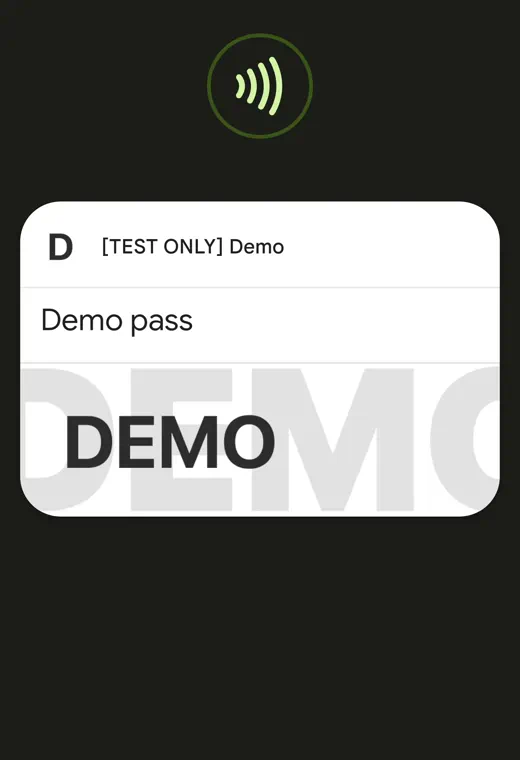

# Google Smart Tap


<p float="left">

 
</p>


# Overview


Google Smart Tap is a proprietary NFC protocol that can be used for sending data from a mobile device to an NFC terminal.

Data is conveyed from the device to the terminal in encrypted form, using keys derived during the channel negotiation phase. At the moment of negotiation, the reader sends a device its collector id, key version, and a signature of derived data signed using the collector key, thus proving to the device that the reader is allowed to get the information.

Only one pass (object) could be conveyed during a single tap (single read).  
If more than one pass is eligible for redemption, a selection carousel will appear and a user will be prompted to tap again.

Version 2.1 was current at the time of writing.


# Application identifiers


Smart Tap can be activated using multiple application ids (AID):

1. Universal VAS AID (hex of encoded `OSE.VAS.01`), also used by Apple VAS.  
    ```
    4f53452e5641532e3031
    ```
2. Smart Tap 1 (Deprecated, does not work anymore)
    ```
    a000000476d0000101
    ```
3. Smart Tap 2
    ```
    a000000476d0000111
    ```

The ususal implementation for most readers is to select `OSE.VAS.01` in order to detect what wallet provider is available on device (stored in TLV tag 50), if "AndroidPay" is the value, then we have a device with Google Wallet, and Smart Tap 2 can be reselected if required.  
As of version 2.1 device nonce and key is returned in OSE, so a separate selection of Smart Tap is not needed.


# Command overview

SmartTap-exclusive commands and responses use multi-layer nested NDEF messages and records for conveying information. 
As of version 2.1 following commands are available:

| Command name             | CLA | INS | P1  | P2  | DATA                                  | LE  | Response data                                                     | NOTES                                                                                                                                                                                    |
| ------------------------ | --- | --- | --- | --- | ------------------------------------- | --- | ----------------------------------------------------------------- | ---------------------------------------------------------------------------------------------------------------------------------------------------------------------------------------- |
| SELECT VAS APPLET        | 00  | A4  | 04  | 00  | VAS AID                               | 00  | BER-TLV                                                           | Optional. Should be implemented if you want to support other wallets with value-added services, as this AID allows to find out what implementation is used without bruteforce            |
| SELECT SMART TAP APPLET  | 00  | A4  | 04  | 00  | Smart Tap VX AID                      | 00  | NDEF message                                                      | Optional if SELECT VAS APPLET has been used.                                                                                                                                             |
| NEGOTIATE SECURE CHANNEL | 90  | 53  | 00  | 00  | NDEF message with nested NDEF message | 00  | NDEF message with nested NDEF                                     |                                                                                                                                                                                          |
| GET DATA                 | 90  | 50  | 00  | 00  | NDEF message with nested NDEF message | 00  | Part of NDEF message with encrypted and/or compressed nested NDEF | Can be used only after channel negotiation                                                                                                                                               |
| GET MORE DATA            | 90  | C0  | 00  | 00  | No data (V 2.1)                       | 00  | Part of NDEF message with encrypted and/or compressed nested NDEF | Can be used if GET DATA response sw is 9100                                                                                                                                              |
| PUSH DATA                | 90  | 52  | 00  | 00  | NDEF message with nested NDEF         | 00  | NDEF message with nested NDEF                                     | Can be used before of after data read. Secure channel not needed. Exact use case of this command is not known. Possible use is to push signup URL but this feature seems to be disabled. |

Commands are executed as follows:
1. SELECT VAS APPLET:  
   Optional. May be the first command in a read flow.
   Reader transmits universal VAS AID; Device response with wallet implementation name in TLV tag `50`.  
   If value is `416e64726f6964506179`, which is a value of `AndroidPay` string in ASCII-encoded form, we have a device that supports SmartTap.  
   Device returns supported versions, other info. For, newer smart tap implementations it returns device nonce and device ephemeral key.
2. SELECT SMART TAP APPLET:  
   Optional. May be the first command in a read flow, or a fallback if SELECT VAS APPLET returned no device nonce or device ephemeral key;
   Device returns version support range, and a device nonce.
3. NEGOTIATE SECURE CHANNEL:  
   Reader generates a nonce, ephemeral public key. Reader generates a signature over concatenation of reader nonce, device nonce, collector id, and reader ephemeral public ke using a private key of collector.  
   It then transmits session-related information together with the signature to the end device, proving to it that the reader is owned by a particular pass collector.
   Device responds with ephemeral public key, session information.
   Reader then uses all collected information in order to calculate session keys that will be used to encrypt and decrypt data.
4. GET DATA:  
   Reader transmits its configuration, capabilityies, session information.
   Device responds with full or partial NDEF data with encrypted nested data.
5. GET MORE DATA:  
   If a response to previous GET DATA or GET MORE DATA returned status word `91 00`, then more data has to be read.
   Reader transmits this command as many times as needed, until a device responds any response rather than `91 00`.
6. PUSH DATA:  
   This command is not known to be used by any IRL readers. It was intended to be used by readers in order to push some information, like sign-up urls, pass data updates, pass addition, etc.  
   None of the possible parameter combinations seem to have any visible effects, so theres a big chance that its a leftover of unfinished or cut functionality.
   Reader transmits session info, list of service statuses (changes to the passes, usage history, URL signups), total transaction info (ability to send receipts).
   Device responds with an acknowledgment and session info.


# Entities, constants and data format

SmartTap protocol uses NDEF records for transmitting data, sometimes in nested fashion.  
Before closer look at communication, it is important to undersand data representation used during communication.


## Data format

Some records may contain a data format identifier in the first byte of payload

Following data formats are known:

| Name        | Field |
| ----------- | ----- |
| UNSPECIFIED | 0x00  |
| ASCII       | 0x01  |
| UTF_8       | 0x02  |
| UTF_16      | 0x03  |
| BINARY      | 0x04  |
| BCD         | 0x05  |

Most common used type is BINARY, but even it is not used for all payloads.  
There seems to be no particular pattern as for where data format identifier is mandatory, so its use will be mentioned for each record type.

## Record types

Type in SmartTap defines what kind of object/data does the record hold. Each type is denoted by a specific short string.
Depending on TNF, type value may be populated into either type or id fields:
Type field follows following rules when being populated into NDEF Records

| TNF              | Field |
| ---------------- | ----- |
| WELL_KNOWN(0x01) | id    |
| EXTERNAL(0x04)   | type  |

Older SmartTap versions required `id` field to be used instead to populate type, but new ones recognize only the described rules.


## Records 

Following types exist in SmartTap, but not all of them are used:

| Name                        | Type | Payload                                                                                                                                                        |
| --------------------------- | ---- | -------------------------------------------------------------------------------------------------------------------------------------------------------------- |
| HANDSET_NONCE               | mdn  | BINARY format flag + 32 byte long nonce                                                                                                                        |
| SESSION                     | ses  | 8 byte long id, 1 byte long sequence counter, 1 byte long status                                                                                               |
| NEGOTIATE_REQUEST           | ngr  | 2 byte long version, nested NDEF message with `ses` and `cpr` records                                                                                          |
| NEGOTIATE_RESPONSE          | nrs  | Nested NDEF message with `ses` and `dpk` records                                                                                                               |
| CRYPTO_PARAMS               | cpr  | 32 byte long reader nonce, 1 byte long auth flag, 33 byte long reader ephemeral public key, 4 byte long key version, NDEF message with `sig` and `cld` records |
| SIGNATURE                   | sig  | BINARY format flag + 72 byte long signature data encoded in ASN1 as Dss-Sig-Value                                                                              |
| SERVICE_REQUEST             | srq  | 2 byte long version, nested NDEF message with `ses`, `mer`, `slr`, `pcr` records                                                                               |
| ADDITIONAL_SERVICE_REQUEST  | asr  | Was used to get data continuation. Unused in SmartTap 2.0                                                                                                                                                               |
| SERVICE_RESPONSE            | srs  | Contains nested `ses` and `reb` records                                                                                                                        |
| MERCHANT                    | mer  | Nested NDEF message with mandatory `cld` and optional `lid`, `tid`, `mnr`, `mcr` records                                                                       |
| COLLECTOR_ID_V0             | mid  |                                                                                                                                                                |
| COLLECTOR_ID                | cld  | 4 byte long big endian representation of collector id number                                                                                                   |
| LOCATION_ID                 | lid  |                                                                                                                                                                |
| TERMINAL_ID                 | tid  |                                                                                                                                                                |
| MERCHANT_NAME               | mnr  |                                                                                                                                                                |
| MERCHANT_CATEGORY           | mcr  |                                                                                                                                                                |
| SERVICE_LIST                | slr  | Nested NDEF message with `str` record                                                                                                                          |
| SERVICE_TYPE_REQUEST        | str  | List of 1 byte long service objects types to request                                                                                                           |
| HANDSET_EPHERMAL_PUBLIC_KEY | dpk  | 33-byte long public ephemeral EC key                                                                                                                           |
| ENCRYPTED_SERVICE_VALUE     | enc  |                                                                                                                                                                |
| SERVICE_VALUE               | asv  | Contains `i` record. Depending on object type, may contain one of `cus`, `et`, `fl`, `gc`, `ly`, `of`, `pl`, `tr`, `gr` records.                               |
| SERVICE_ID                  | sid  |                                                                                                                                                                |
| OBJECT_ID                   | oid  | BINARY format flag + 8 byte identifier                                                                                                                         |
| RECORD_BUNDLE               | reb  | First byte is response flag, other bytes is encrypted and/or compressed data depending on flag, containing `asv` object records                                |
| CUSTOMER                    | cus  | May be contained in unpacked record bundle. Contains                                                                                                           |
| CUSTOMER_ID                 | cid  | BINARY format flag + 16 byte identifier                                                                                                                        |
| CUSTOMER_LANGUAGE           | cpl  | NDEF-encoded string with language code                                                                                                                         |
| CUSTOMER_TAP_ID             | cut  | BINARY format flag + 16 byte identifier                                                                                                                        |
| EVENT                       | et   | Object                                                                                                                                                         |
| FLIGHT                      | fl   | Object                                                                                                                                                         |
| GIFT_CARD                   | gc   | Object                                                                                                                                                         |
| LOYALTY                     | ly   | Object                                                                                                                                                         |
| OFFER                       | of   | Object                                                                                                                                                         |
| PLC                         | pl   | Object                                                                                                                                                         |
| TRANSIT                     | tr   | Object                                                                                                                                                         |
| GENERIC                     | gr   | Object                                                                                                                                                         |
| ISSUER                      | i    | BINARY format flag + 5 byte identifier                                                                                                                         |
| SERVICE_NUMBER              | n    | UNSPECIFIED format flag + variable length value of a particular service. In essence, this is the pass data.                                                    |
| TRANSACTION_COUNTER         | tcr  |                                                                                                                                                                |
| PIN                         | p    |                                                                                                                                                                |
| EXPIRATION_DATE             | ex   |                                                                                                                                                                |
| CVC                         | c1   |                                                                                                                                                                |
| POS_CAPABILITIES            | pcr  | Contains 5 byte long flag POS CAPABILITIES mask                                                                                                                |
| PUSH_SERVICE_REQUEST        | spr  | Nested NDEF message with mandatory `ses` and optional, `bpr`, `nsr`, `ssr` records                                                                             |
| PUSH_SERVICE_RESPONSE       | psr  | Nested NDEF message with `ses` record                                                                                                                          |
| SERVICE_STATUS              | ssr  | Nested NDEF message with `oid`, `sug` and `sup` records                                                                                                        |
| SERVICE_USAGE               | sug  | Nested NDEF message with `sut` and `sud` records                                                                                                               |
| SERVICE_USAGE_TITLE         | sut  | NDEF encoded text                                                                                                                                              |
| SERVICE_USAGE_DESCRIPTION   | sud  | NDEF encoded text                                                                                                                                              |
| SERVICE_UPDATE              | sup  | 1 byte long service operation code concatenated with value                                                                                                     |
| NEW_SERVICE                 | nsr  | Nested NDEF message with `nst` and `nsu` records                                                                                                               |
| NEW_SERVICE_TITLE           | nst  | NDEF encoded text                                                                                                                                              |
| NEW_SERVICE_URI             | nsu  | NDEF encoded URI                                                                                                                                               |
| BASKET_PRICE                | bpr  | Nested NDEF message with `mon` and `ccd` records                                                                                                               |
| BASKET_PRICE_AMOUNT         | mon  | Numeric price value                                                                                                                                            |
| BASKET_PRICE_CURRENCY       | ccd  | NDEF encoded text currency code                                                                                                                                |

Records marked as `Object` in value are transmitted in GET DATA response.  
Inner fields of objects depend on object type, but usually, each object contains at least `i` and `n` records in nested NDEF message.

## Statuses

Status field is returned inside of the session record as the last byte.

| Name                    | Value |
| ----------------------- | ----- |
| UNKNOWN                 | 0x00  |
| OK                      | 0x01  |
| NDEF_FORMAT_INVALID     | 0x02  |
| UNSUPPORTED_VERSION     | 0x03  |
| INVALID_SEQUENCE_NUMBER | 0x04  |
| UNKNOWN_MERCHANT        | 0x05  |
| MERCHANT_INFO_MISSING   | 0x06  |
| SERVICE_DATA_MISSING    | 0x07  |
| RESEND_REQUEST          | 0x08  |
| DATA_NOT_AVAILABLE_YET  | 0x09  |


## Terminal capabilities   

Used in side POS capabilities record. Capabilities are listed like bytes in order from left to right (aka reverse order)

System capabilities:
| Name                   | Value | Effect                                       |
| ---------------------- | ----- | -------------------------------------------- |
| SYSTEM_STANDALONE      | 0x01  |                                              |
| SYSTEM_SEMI_INTEGRATED | 0x02  |                                              |
| SYSTEM_UNATTENDED      | 0x04  |                                              |
| SYSTEM_ONLINE          | 0x08  |                                              |
| SYSTEM_OFFLINE         | 0x10  |                                              |
| SYSTEM_MMP             | 0x20  |                                              |
| SYSTEM_ZLIB_SUPPORTED  | 0x40  | Pass data will be compressed. Adviced to use |

User interface capabilities. No known effects:   

| Name                | Value | Effect |
| ------------------- | ----- | ------ |
| UI_PRINTER          | 0x01  |        |
| UI_PRINTER_GRAPHICS | 0x02  |        |
| UI_DISPLAY          | 0x04  |        |
| UI_IMAGES           | 0x08  |        |
| UI_AUDIO            | 0x10  |        |
| UI_ANIMATION        | 0x20  |        |
| UI_VIDEO            | 0x40  |        |

Checkout capabilities.  No known effects:   

| Name                              | Value | Effect |
| --------------------------------- | ----- | ------ |
| CHECKOUT_SUPPORT_PAYMENT          | 0x01  |        |
| CHECKOUT_SUPPORT_DIGITAL_RECEIPT  | 0x02  |        |
| CHECKOUT_SUPPORT_SERVICE_ISSUANCE | 0x04  |        |
| CHECKOUT_SUPPORT_OTA_POS_DATA     | 0x08  |        |

CVM capabilities.  No known effects:
| Name                      | Value | Effect |
| ------------------------- | ----- | ------ |
| CVM_ONLINE_PIN            | 0x01  |        |
| CVM_CD_PIN                | 0x02  |        |
| CVM_SIGNATURE             | 0x04  |        |
| CVM_NOCVM                 | 0x08  |        |
| CVM_DEVICE_GENERATED_CODE | 0x10  |        |
| CVM_SP_GENERATED_CODE     | 0x20  |        |
| CVM_ID_CAPTURE            | 0x40  |        |
| CVM_BIOMETRIC             | 0x80  |        |

VAS Type capabilities. Set proper type for proper UI interaction:
| Name                  | Value | Effect |
| --------------------- | ----- | ------ |
| TAP_PASS_ONLY         | 0x01  |        |
| TAP_PAYMENT_ONLY      | 0x02  |        |
| TAP_PASS_AND_PAYMENT  | 0x04  |        |
| TAP_PASS_OVER_PAYMENT | 0x08  |        |


## Request object type

Used in service request list:
| Name                      | Value |
| ------------------------- | ----- |
| ALL                       | 0x00  |
| ALL_EXCEPT_PPSE           | 0x01  |
| PPSE                      | 0x02  |
| LOYALTY                   | 0x03  |
| OFFER                     | 0x04  |
| GIFT_CARD                 | 0x05  |
| PRIVATE_LABEL_CARD        | 0x06  |
| EVENT_TICKET              | 0x07  |
| FLIGHT                    | 0x08  |
| TRANSIT                   | 0x09  |
| CLOUD_BASED_WALLET        | 0x10  |
| MOBILE_MARKETING_PLATFORM | 0x11  |
| GENERIC                   | 0x12  |
| WALLET_CUSTOMER           | 0x40  |


## Push Data related options

PUSH DATA seems to be cut or limited in newer versions of SmartTap. This info is provided solely for reference, it has no use IRL.

### Push service type

| Name        | Value |
| ----------- | ----- |
| UNSPECIFIED | 0x00  |
| VALUABLE    | 0x01  |
| RECEIPT     | 0x02  |
| SURVEY      | 0x03  |
| GOODS       | 0x04  |
| SIGNUP      | 0x05  |

### Service status usage

| Name           | Value |
| -------------- | ----- |
| UNDEFINED      | 0x00  |
| SUCCESS        | 0x01  |
| INVALID_FORMAT | 0x02  |
| INVALID_VALUE  | 0x03  |
| UNKNOWN        | 0xff  |

### Service update operation

| Name             | Value |
| ---------------- | ----- |
| NO_OP            | 0x00  |
| REMOVE           | 0x01  |
| SET_BALANCE      | 0x02  |
| ADD_BALANCE      | 0x03  |
| SUBTRACT_BALANCE | 0x04  |
| FREE             | 0x05  |
| UNKNOWN          | 0xFF  |


# Command and response data format

## Status words

Following status words may be met during proper communication

| SW1 | SW2 | Meaning                 |
| --- | --- | ----------------------- |
| 90  | 00  | Ok                      |
| 90  | 91  | More data pending       |
| 90  | 01  | No passes               |
| 94  | 06  | Too many requests       |
| 93  | 02  | User has to choose pass |

## SELECT VAS APPLET

### Request:

   | CLA | INS | P1  | P2  | DATA                   | LE  | 
   | --- | --- | --- | --- | ---------------------- | --- |
   | 00  | A4  | 04  | 00  | `4f53452e5641532e3031` | 00  | 

   Data contains an ASCII encoded form of "OSE.VAS.01" string;

### Response
   
   | SW1 | SW2 | DATA                                       |
   | --- | --- | ------------------------------------------ |
   | 90  | 00  | Dynamic. Data format below. 135 bytes long |


   Response data example:  
   - Payload:
     - `6f8184500a416e64726f6964506179c0020001c108cc00000000008080c22056d2ec8f857f0049aa54f1ca1de2791b5693a7014e6e4565d5644b1c2a305136c32103dfee38dbdb68a607383ad622640b180cc7e27d796b4e788c40e5d994291c71fca523bf0c20611e4f09a000000476d0000111870101730edf6d020000df4d020001df620103`
   - TLV decoded:
      ```
      TLV:
        6f[8184]: # File Control Information Template
            50[0a]: # Application Label
               416e64726f6964506179 # ASCII form of "AndroidPay"
            c0[02]: # Application version
               0001
            c1[08]: # Unknown. Feature flags?
               cc00000000008080
            c2[20]: # Mobile device Nonce
               56d2ec8f857f0049aa54f1ca1de2791b5693a7014e6e4565d5644b1c2a305136
            c3[21]: # Mobile device ephemeral key
               03dfee38dbdb68a607383ad622640b180cc7e27d796b4e788c40e5d994291c71fc
            a5[23]: 
               bf0c[20]:
                  61[1e]:
                     4f[09]: # Application ID
                        a000000476d0000111
                     87[01]: # Priority
                        01
                     73[0e]: # Proprietary data
                        df6d[02]: # Minimum version
                           0000
                        df4d[02]: # Maximum version
                           0001
                        df62[01]: # Unknown. Format flags?
                           03
      ```

      Tags `c1`, `c2`, `c3`, `a5`, `73` may be missing depending on device software version. Be aware of this fact.  

   
## SELECT SMART TAP APPLET

### Request:

   | CLA | INS | P1  | P2  | DATA                 | LE  |
   | --- | --- | --- | --- | -------------------- | --- |
   | 00  | A4  | 04  | 00  | `a000000476d0000111` | 00  |

### Response
   
   | SW1 | SW2 | DATA                                      |
   | --- | --- | ----------------------------------------- |
   | 90  | 00  | Dynamic. Data format below. 47 bytes long |

Response data example:  
   - Payload:
     - `00000001dc0321036d646e6d646e0456d2ec8f857f0049aa54f1ca1de2791b5693a7014e6e4565d5644b1c2a305136`
   - Decoded:
      ```
      min_version=0000
      max_version=0001
      message=NDEFMessage(
         NDEFRecord(
            tnf=EXTERNAL(04), 
            type=bytearray(b'mdn'), 
            id=bytearray(b'mdn'), 
            payload=0x0456d2ec8f857f0049aa54f1ca1de2791b5693a7014e6e4565d5644b1c2a305136
         )
      )
      ```

## NEGOTIATE SECURE CHANNEL

### Request:

   | CLA | INS | P1  | P2  | DATA                        | LE  |
   | --- | --- | --- | --- | --------------------------- | --- |
   | 90  | 53  | 00  | 00  | Dynamic. Data format below. | 00  |

Command data example:
   - Payload:
     - `d403b86e6772000194030a7365736b159a80fc8283fd00015403a0637072a8aa2bae1ba891783d8c5be8a95bf2f9e5bb90fd9d197f8b2b1a84d9cc80427501027b2e12f1a1a542084b4d01b8799380fa4cb77e530ba2305b0bf2b3e4b474fe7d0000000194034973696704304602210086e43dc483b22e51aa177ae8112ed83d399a58b41d6d8cbe900cde03c4524da5022100e94b6a919c9e097568f4efa9a7123b86b97ee44342593f8a77fc9e12e3f95ae4540305636c640401020304`
   - Decoded:
      ```
      message=NDEFMessage(
         NDEFRecord(
            tnf=EXTERNAL(04),
            type=b'ngr',
            id=b'',
            payload=[
               Version(00:01), 
               NDEFMessage(
                  NDEFRecord(
                     tnf=EXTERNAL(04),
                     type=b'ses',
                     id=b'',
                     payload=[
                        0x6b159a80fc8283fd,
                        0x00, 
                        OK(01)
                     ]
                  ), 
                  NDEFRecord(
                     tnf=EXTERNAL(04),
                     type=b'cpr',
                     id=b'',
                     payload=[
                        0xa8aa2bae1ba891783d8c5be8a95bf2f9e5bb90fd9d197f8b2b1a84d9cc804275, 
                        0x01, 
                        0x027b2e12f1a1a542084b4d01b8799380fa4cb77e530ba2305b0bf2b3e4b474fe7d,
                        0x00000001,
                        NDEFMessage(
                           NDEFRecord(
                              tnf=EXTERNAL(04),
                              type=b'sig',
                              id=b'',
                              payload=[
                                 BINARY(04), 
                                 0x304602210086e43dc483b22e51aa177ae8112ed83d399a58b41d6d8cbe900cde03c4524d
                                    a5022100e94b6a919c9e097568f4efa9a7123b86b97ee44342593f8a77fc9e12e3f95ae4
                              ]
                           ), 
                           NDEFRecord(
                              tnf=EXTERNAL(04),
                              type=b'cld',
                              id=b'',
                              payload=[
                                 BINARY(04), 
                                 0x01020304
                              ]
                           )
                        )
                     ]
                  )
               )
            ]
         )
      )
      ```

### Response
   
   | SW1 | SW2 | DATA                                      |
   | --- | --- | ----------------------------------------- |
   | 90  | 00  | Dynamic. Data format below. 61 bytes long |

Response data example:  
   - Payload:
     - `d403376e727394030a7365736b159a80fc8283fd010154032164706b03dfee38dbdb68a607383ad622640b180cc7e27d796b4e788c40e5d994291c71fc`
   - Decoded:
      ```
      NDEFMessage(
         NDEFRecord(
            tnf=EXTERNAL(04), 
            type=bytearray(b'nrs'),
            id=bytearray(b''),
            payload=NDEFMessage(
               NDEFRecord(
                  tnf=EXTERNAL(04),
                  type=b'ses',
                  id=b'',
                  payload=[
                     0x6b159a80fc8283fd,
                     0x01,
                     0x01
                  ]
               ),
               NDEFRecord(
                  tnf=EXTERNAL(04),
                  type=b'dpk',
                  id=b'',
                  payload=[
                     0x03dfee38dbdb68a607383ad622640b180cc7e27d796b4e788c40e5d994291c71fc
                  ]
               )
            )
         )
      )
      ```

## GET DATA

### Request:

   | CLA | INS | P1  | P2  | DATA                        | LE  |
   | --- | --- | --- | --- | --------------------------- | --- |
   | 90  | 50  | 00  | 00  | Dynamic. Data format below. | 00  |

Command data example:
   - Payload:
     - `d4033b737271000194030a7365736b159a80fc8283fd010114030b6d6572d40305636c640401020304140307736c72d40301737472005403057063724100000004`
   - Decoded:
      ```
      message=NDEFMessage(
         NDEFRecord(
            tnf=EXTERNAL(04), 
            type=b'srq', 
            id=b'', 
            payload=[
               Version(00:01), 
               NDEFMessage(
                  NDEFRecord(
                     tnf=EXTERNAL(04), 
                     type=b'ses', 
                     id=b'', 
                     payload=[
                        0x6b159a80fc8283fd,
                        0x01,
                        OK(01)
                     ]
                  ),
                  NDEFRecord(
                     tnf=EXTERNAL(04),
                     type=b'mer',
                     id=b'',
                     payload=NDEFMessage(
                        NDEFRecord(
                           tnf=EXTERNAL(04),
                           type=b'cld',
                           id=b'',
                           payload=[
                              BINARY(04),
                              0x01020304
                           ]
                        )
                     )
                  ), 
                  NDEFRecord(
                     tnf=EXTERNAL(04),
                     type=b'slr',
                     id=b'',
                     payload=NDEFMessage(
                        NDEFRecord(
                           tnf=EXTERNAL(04),
                           type=b'str',
                           id=b''
                           payload=0x00
                        )
                     )
                  ), 
                  NDEFRecord(
                     tnf=EXTERNAL(04),
                     type=b'pcr',
                     id=b'',
                     payload=[SYSTEM_ZLIB_SUPPORTED(40) + SYSTEM_STANDALONE(01), 0x00, 0x00, 0x00, TAP_PASS_AND_PAYMENT(04)]
                  )
               )
            ]
         )
      )
      ```

### Response:

   | SW1 | SW2 | DATA                        |
   | --- | --- | --------------------------- |
   | XX  | XX  | Dynamic. Data format below. |

Status word differs if:
1) Pass data is available;
2) Pass data is available, but more data is pending;
3) Pass data is unavailable;
4) User has to select a pass

Response may contain a part or a full NDEF message with nested encrypted and or compressed nested NDEF message

Full* response data example:
   - Payload:
     - `d403ce73727394030a7365736b159a80fc8283fd02015403b8726562031c5b7d2e9f0f6937a7c043dc6913dd976002ce5cf179dedbcaaab629442a89a72b6a92caa26e808903a6d02207fd2d42702161d21c76f0a2a135bd8d45ac796786787e268bcc7498d17eccab47ad98be601a3470618fcd9790b40e3c324fc01ec29a98d1cb784fd4390ea1b045437cfdfa121447854c5ae5375c3f721a7a9f80b7da35868e063f18c545f07d934e4cc557fc93ee52b6231c95ef2d2d1de6be82be0d76e8d555dc41cc4894e44af98c68e4245e5bb6cecc`
   - Decoded:
     ```
      message=NDEFMessage(
         NDEFRecord(
            tnf=EXTERNAL(04),
            type=b'srs',
            id=b'',
            payload=NDEFMessage(
               NDEFRecord(
                  tnf=EXTERNAL(04), 
                  type=b'ses', 
                  id=b'', 
                  payload=[
                     0x6b159a80fc8283fd,
                     0x02,
                     OK(01)
                  ]
               ),
               NDEFRecord(
                  tnf=EXTERNAL(04), 
                  type=b'reb', 
                  id=b'', 
                  payload=0x031c5b7d2e9f0f6937a7c043dc6913dd976002ce5cf179dedbcaaab629442a89a72b6a92caa26e808903a6d02207fd2d42702161d21c76f0a2a135bd8d45ac796786787e268bcc7498d17eccab47ad98be601a3470618fcd9790b40e3c324fc01ec29a98d1cb784fd4390ea1b045437cfdfa121447854c5ae5375c3f721a7a9f80b7da35868e063f18c545f07d934e4cc557fc93ee52b6231c95ef2d2d1de6be82be0d76e8d555dc41cc4894e44af98c68e4245e5bb6cecc
               )
            )
         )
      )
     ```

## GET MORE DATA

### Request:

   | CLA | INS | P1  | P2  | DATA | LE  |
   | --- | --- | --- | --- | ---- | --- |
   | 90  | c0  | 00  | 00  | None | 00  |

### Response:

Same format and rules as in GET DATA


## PUSH DATA

**This command has no effect and seems to be a leftover from unfinished/cut functionality.**  
Information is provided for reference only

### Request:

   | CLA | INS | P1  | P2  | DATA                        | LE  |
   | --- | --- | --- | --- | --------------------------- | --- |
   | 90  | 52  | 00  | 00  | Dynamic. Data format below. | 00  |

Command data example:
   - Payload:
     - `d403b9737072000194030a7365736b159a80fc8283fd02011403126270729403016d6f6e0059010303546363645553441403246e73720599010703546e737402656e5041535359010c03556e7375046578616d706c652e636f6d54035f7373729403096f696404010203dc3be19e4814034373756701990116035473757402656e534552564943455f55534147455f5449544c4559011c035473756402656e534552564943455f55534147455f4445534352495054494f4e54030173757005`
   - Decoded:
   ```
   message=NDEFMessage(
      NDEFRecord(
         tnf=EXTERNAL(04),
         type=b'spr',
         id=b'',
         payload=[
            Version(00:01),
            NDEFMessage(
               NDEFRecord(
                  tnf=EXTERNAL(04),
                  type=b'ses',
                  id=b'',
                  payload=[0x6b159a80fc8283fd, 0x02, OK(01)]
               ), 
               NDEFRecord(
                  tnf=EXTERNAL(04),
                  type=b'bpr',
                  id=b'',
                  payload=NDEFMessage(
                     NDEFRecord(
                        tnf=EXTERNAL(04),
                        type=b'mon',
                        id=b'',
                        payload=0x00
                     ), 
                     NDEFRecord(
                        tnf=WELL_KNOWN(01),
                        type=b'T',
                        id=b'ccd',
                        payload=b'USD'
                     )
                  ) 
               ), 
               NDEFRecord(
                  tnf=EXTERNAL(04), 
                  type=b'nsr', 
                  id=b'', 
                  payload=[
                     SIGNUP(05), 
                     NDEFMessage(
                        NDEFRecord(
                           tnf=WELL_KNOWN(01),
                           type=b'T',
                           id=b'nst',
                           payload=0x02656e50415353
                        ), 
                        NDEFRecord(
                           tnf=WELL_KNOWN(01),
                           type=b'U',
                           id=b'nsu',
                           payload=0x046578616d706c652e636f6d
                        )
                     )
                  ]
               ), 
               NDEFRecord(
                  tnf=EXTERNAL(04),
                  type=b'ssr',
                  id=b'',
                  payload=NDEFMessage(
                     NDEFRecord(
                        tnf=EXTERNAL(04),
                        type=b'oid',
                        id=b'',
                        payload=[BINARY(04), 0x01, 0x02, 0x03, 0xdc, 0x3b, 0xe1, 0x9e, 0x48]
                     ), 
                     NDEFRecord(
                        tnf=EXTERNAL(04),
                        type=b'sug',
                        id=b'',
                        payload=[
                           SUCCESS(01), 
                           NDEFMessage(
                              NDEFRecord(
                                 tnf=WELL_KNOWN(01),
                                 type=b'T',
                                 id=b'sut',
                                 payload=02656e534552564943455f55534147455f5449544c45
                              ), 
                              NDEFRecord(
                                 tnf=WELL_KNOWN(01),
                                 type=b'T',
                                 id=b'sud',
                                 payload=02656e534552564943455f55534147455f4445534352495054494f4e
                              )
                           )
                        ]
                     ), 
                     NDEFRecord(
                        tnf=EXTERNAL(04),
                        type=b'sup',
                        id=b'',
                        payload=[FREE(05)]
                     )
                  )
               )
            )
         ]
      )
   )
   ```

### Response
   
   | SW1 | SW2 | DATA                                      |
   | --- | --- | ----------------------------------------- |
   | 90  | 00  | Dynamic. Data format below. 61 bytes long |

Response data example:  
   - Payload:
     - `d40310707372d4030a7365736b159a80fc8283fd0301`
   - Decoded:
      ```
      message=NDEFMessage(
         NDEFRecord(
            tnf=EXTERNAL(04),
            type=b'psr',
            id=b'',
            payload=NDEFMessage(
               NDEFRecord(
                  tnf=EXTERNAL(04),
                  type=b'ses',
                  id=b'',
                  payload=0x6b159a80fc8283fd0301
               )
            )
         )
      )
      ```

# Cryptography

## NEGOTIATE SECURE CHANNEL Signature

During the NEGOTIATE SECURE CHANNEL command, reader has to prove to the device that it is allowd to retreive particular objects (read as passes).  

To generate a proof, device uses a collector private key in order to sign following data retreived prior during communication:

| Order | Name                              | Length | Example                                                            | Notes |
| ----- | --------------------------------- | ------ | ------------------------------------------------------------------ | ----- |
| 1     | reader_nonce                      | 32     | 7131b05f5cfbd94feae19204d59d4ee5a4ce8172462e3f4577426040916e5b48   |       |
| 2     | device_nonce                      | 32     | 00f363e09bd98d971bda253bb5e001e554d5255b6adf0713c8bfc7eea4e3957f   |       |
| 3     | collector_id                      | 4      | 01020304                                                           |       |
| 4     | reader_ephemeral_public_key_bytes | 33     | 03c3d36bf9509924f159e9b5f02cb3d479d2fde4dedde1a8054fd5018286b2e6f8 |       |

When concatenated, the byte string to sign would be:  
```
data_to_sign = 7131b05f5cfbd94feae19204d59d4ee5a4ce8172462e3f4577426040916e5b4800f363e09bd98d971bda253bb5e001e554d5255b6adf0713c8bfc7eea4e3957f0102030403c3d36bf9509924f159e9b5f02cb3d479d2fde4dedde1a8054fd5018286b2e6f8`
```

Then, using reader long term private key (the version of which is defined inside `cpr` record), device generates a 72-byte long ASN1 encoded Dss-Sig-Value signature:
```
signature = 3046022100cc4414b542a2fc42d41a29da56e897cb38593380fe529d473f24b8c450f422c7022100f0160f981dd28ec2842f8ed5e9adc533b685258987fd602815caf88aa08f8ddd
```

Keep values of `data_to_sign` and `signature` in mind, as they'll be used later for session key generation.

## GET DATA Encryption

To decrypt GET DATA response payload, we have to establish encryption keys.


Shared key is generated using ECDH exchange of ephemeral device public and reader private keys:
   
```
shared_key = ECDH(reader_ephemeral_private_key, device_ephemeral_public_key)
```

Then, using the HKDF, data is generated with following parameters

| Name         | Value                             |
| ------------ | --------------------------------- |
| algorithm    | SHA256                            |
| length       | 48                                |
| salt         | device_ephemeral_public_key_bytes |
| shared_info  | data_to_sign  + signature         |
| key_material | shared_key                        |

As a result, we get 48 bytes of keying material `derived_ephemeral_key`.

First 16 bytes are used as an AES encryption key:  
`aes_key=derived_ephemeral_key[:16]`  

Next 32 bytes are used for HMAC key:  
`hmac_key=derived_ephemeral_key[16:]`

Those keys are used to verify and decrypt GET DATA responses:
Encryption/Decryption uses AES CTR algorithm.

IV is provided in first 12 bytes of payload:  
`iv = payload[:12]`  
Ciphertext is the middle bytes starting from 12 and ending with -32 from the end:  
`ciphertext = payload[12:-32]`  
HMAC is provided in last 32 bytes of payload:  
`hmac = payload[-32:]`  

HMAC has to be verified over whole IV + Ciphertext value.
For decryption, IV is appended with zero bytes until it's length becomes 16.

Following Python pseudocode (with cryptography library) decribes the decryption proccess:  
```

from cryptography.hazmat.primitives import hashes
from cryptography.hazmat.primitives.asymmetric import ec
from cryptography.hazmat.primitives.ciphers import Cipher, algorithms, modes
from cryptography.hazmat.primitives.hmac import HMAC
from cryptography.hazmat.primitives.kdf.hkdf import HKDF

iv = payload[:12]
ciphertext = payload[12:-32]
hmac = payload[-32:]

h = HMAC(hmac_key, hashes.SHA256())
h.update(iv + ciphertext)
hmac_to_verify = h.finalize()

cipher = Cipher(algorithms.AES(aes_key), modes.CTR(iv + (b'\x00' * (16 - len(iv)))))
decryptor = cipher.decryptor()
decrypted_data = decryptor.update(ciphertext) + decryptor.finalize()
payload = decrypted_data
```

# Other

## Compression

If ZLIB support has been toggled on in POS capabilities, inner decrypted payload will be compressed with ZLIB.
To uncompress, use libraries or methods depending on your programming language of choice.  

# Notes

- If you find any mistakes/typos or have extra information to add, feel free to raise an issue or create a pull request.
- Information provided in this repository is intended for educational, research, and personal use. Its use in any other way is not encouraged.  
- **Beware** that SmartTap, just like any other proprietary technology, might be a subject to legal protections depending on jurisdiction. A mere fact of it being reverse-engineered **does not** always mean that it can be used in a commercial product as-is without causing an infringement. For use in commercial applications, you should contact Google through official channels in order to get approval.
- Reverse-engineering efforts were started way before Google published an open-source implementation example at the end of 2022, which made this project somewhat obsolete.  
  There are some aspects still left uncovered (such as data format, parameters, extra commands), goal of this repo would be to describe blind spots in more detail in the near future ©, plus to provide examples, such as communication logs.


# References


- Google resources:
  - [Google Smart Tap](https://developers.google.com/wallet/smart-tap);
  - [Smart Tap overview](https://developers.google.com/wallet/smart-tap/introduction/overview);
  - [Smart Tap communication flow](https://developers.google.com/wallet/smart-tap/introduction/communication-flow);
  - [Smart Tap example project](https://github.com/google-pay/smart-tap-sample-app). Note that it does not implement the full protocol, for instance "Get more data" and "Push data" commands are missing;
- Analysed applications:
  - [Google Play services](https://play.google.com/store/apps/details?id=com.google.android.gms&hl=en_US);
  - [Google Wallet](https://wallet.google).
- Software analysis tools:
  - [Jadx](https://github.com/skylot/jadx).
