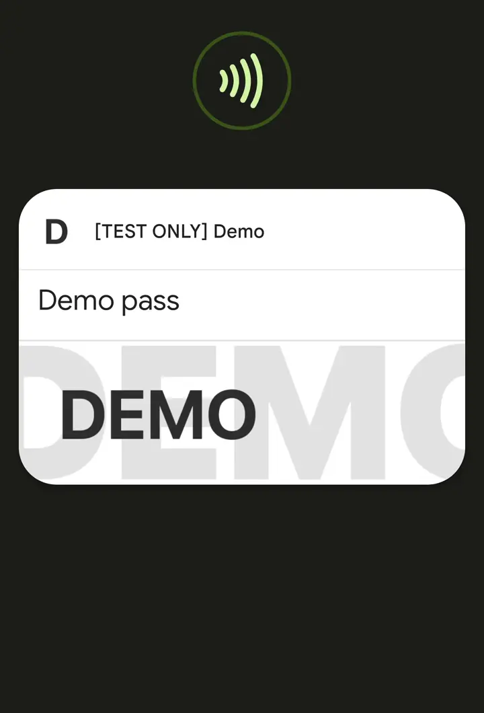
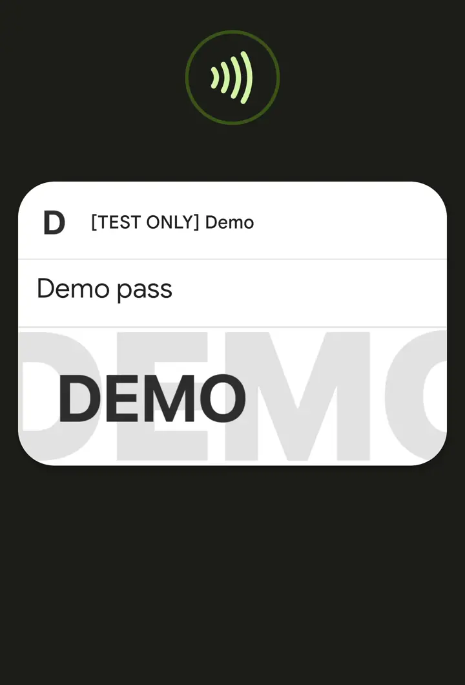

# Google Smart Tap




Google Smart tap is a proprietary NFC protocol that can be used for sending data from a mobile device to an NFC terminal.

Data is conveyed from the device to the terminal in encrypted form, using keys derived during the channel negotiation phase. At the moment of negotiation, the reader sends a device its collector id, key version, and a signature of derived data signed using the collector key, thus proving to the device that the reader is allowed to get the information.

Only one pass (object) could be conveyed during a single tap (single read).  
If more than one pass is eligible for redemption, a selection carousel will appear and a user will be prompted to tap again.

Version 2.1 was current at the time of writing.


# Application identifiers


Smart Tap can be activated using multiple application ids (AID):

1. Universal VAS AID (hex of encoded 'OSE.VAS.01'), also used by Apple VAS.  
    ```
    4f53452e5641532e3031
    ```
2. Smart Tap 1 (Deprecated, does not work anymore)
    ```
    a000000476d0000101
    ```
3. Smart Tap 2
    ```
    a000000476d0000111
    ```

The ususal implementation for most readers is to select OSE.VAS.01 in order to detect what wallet provider is available on device (stored in TLV tag 50), if "AndroidPay" is the value, then we have a device with Google Wallet, and Smart Tap 2 can be reselected if required.  
As of version 2.1 device nonce and key is returned in OSE, so a separate selection of Smart Tap is not needed.


# Commands


As of version 2.1 following commands are available:

| Command name             | CLA  | INS  | P1   | P2   | DATA             | LE   | NOTES                                       |
|--------------------------|------|------|------|------|------------------|------|---------------------------------------------|
| Select Smart Tap         | 00   | A4   | 04   | 00   | Smart Tap AID    | 00   |                                             |
| Negotiate secure channel | 90   | 53   | 00   | 00   | Coming soon      | 00   |                                             |
| Get data                 | 90   | 50   | 00   | 00   | Coming soon      | 00   | Can be used only after channel negotiation  |
| Get more data            | 90   | C0   | 00   | 00   | No data (V 2.1)  | 00   | Can be used if GET DATA response sw is 9100 |
| Push data                | 90   | 52   | 00   | 00   | Coming soon      | 00   | Can be used before of after data read. Secure channel not needed. Exact use case of this command is not known. Possible use is to push signup URL but this feature is disabled. |


SmartTap-exclusive commands and responses use NDEF messages and records for conveying infomration. 


